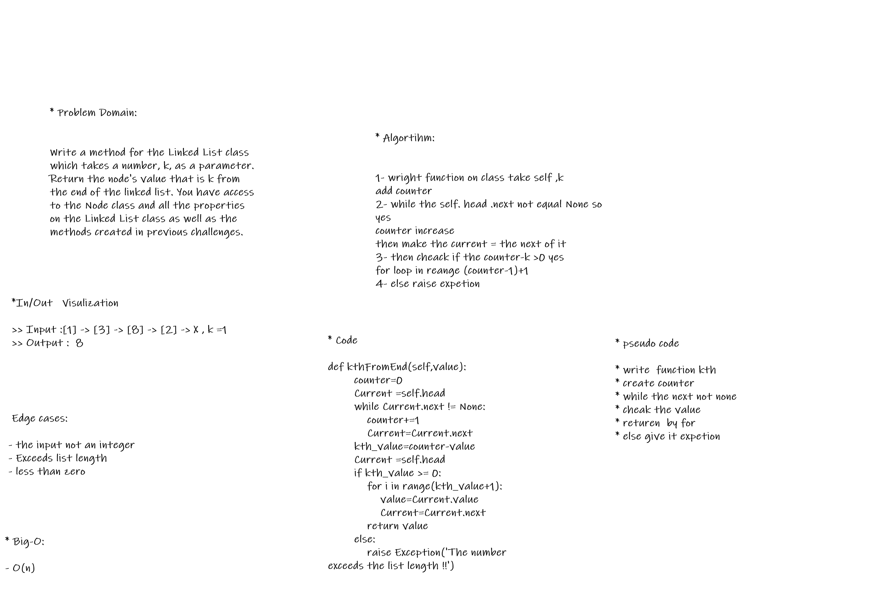

# Singly Linked List
A singly linked list is a type of linked list that is unidirectional, that is, it can be traversed in only one direction from head to the last node (tail). Each element in a linked list is called a node. A single node contains data and a pointer to the next node which helps in maintaining the structure of the list.

## Challenge

Challenge-05

Create a Node class that has properties for the value stored in the Node, and traversed on it and doing some function 

Challenge-06

.append(value) which adds a new node with the given value to the end of the list
.insertBefore(value, newVal) which add a new node with the given newValue immediately before the first value node
.insertAfter(value, newVal) which add a new node with the given newValue immediately after the first value node

Challenge-07 
* Write a method for the Linked List class which takes a number, k, as a parameter. Return the node's value that is k from the end of the linked list. You have access to the Node class and all the properties on the Linked List class as well as the methods created in previous challenges.

# Code Challenge-06 Whiteboarding

## Approach & Efficiency
learn a lot about LinkedList how to deal with it and traversed throw it 

## API
- `name=linkedlist()`= to creat a new linked list
- ` name.insert(value)`= Adds a node of a value to the head of LinkedList
- ` name.includes(value)`=Return T/F if value is in the linked list or not
- ` name.__str__(value)`=   "{ a } -> { b } -> { c } -> NULL" / Loop over all nodes / print all values in one line

-----------------------------------------
Challenge-06
- `name.append(value)`= Adds a node of a value to the end of LinkedList
- - `name.insertBefor(self,value,newVal)`= which add a new node with the given newValue immediately before the first value node
-`name.insertAfter(self,value,newVal)`=which add a new node with the given newValue immediately after the first value node

-`kthFromEnd:` Return the node’s value that is k from the end of the linked list

