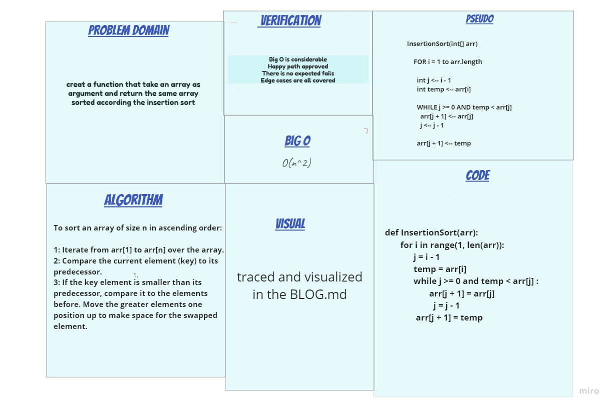

# Challenge Summary

for the Insertion Sort trace the algorithm by stepping through the process with the provided sample array. Document your explanation by creating a blog article that shows the step-by-step output after each iteration through some sort of visual.

## Whiteboard Process

## Approach & Efficiency

Sorting is typically done in-place, by iterating up the array, growing the sorted list behind it. At each array-position, it checks the value there against the largest value in the sorted list (which happens to be next to it, in the previous array-position checked). If larger, it leaves the element in place and moves to the next. If smaller, it finds the correct position within the sorted list, shifts all the larger values up to make a space, and inserts into that correct position.

## Solution

[blog](BLOG.md)