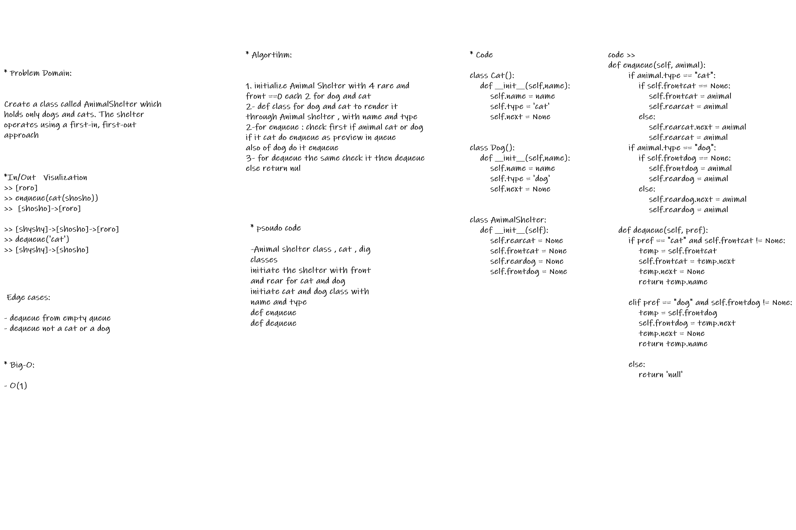

# Challenge Summary
Create a class called AnimalShelter which holds only dogs and cats. The shelter operates using a first-in, first-out approach.
Implement the following methods:
enqueue(animal): adds animal to the shelter. animal can be either a dog or a cat object.
dequeue(pref): returns either a dog or a cat. If pref is not "dog" or "cat" then return null.

## Whiteboard Process

## Approach & Efficiency

1- initialize Animal Shelter with 4 rare and front ==0 each 2 for dog and cat
2- def class for dog and cat to render it through Animal shelter , with name and type
3-for enqueue : check first if animal cat or dog
if it cat do enqueue as preview in queue
also of dog do it enqueue
4- for dequeue the same check it then dequeue
else return nul

