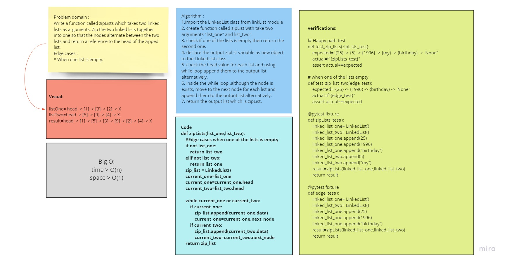

# Challenge Summary

### challenge is to create a function that can get two linked lists and merge them into one linked list in a unique sequence
## Whiteboard Process

### ll-zip

## Approach & Efficiency

### i defined the function to accept two linked lists arguments, check which one is the big one, extract the values from the second linked list and insert them one by one in a sequence after each node in the first linked list then return the modified first linked list

## Solution

### to zip two linked lists in one linked list then use `zip_Lists(list1, list2)`

[file-link](ll_zip/ll_zip.py)

[PR]()
