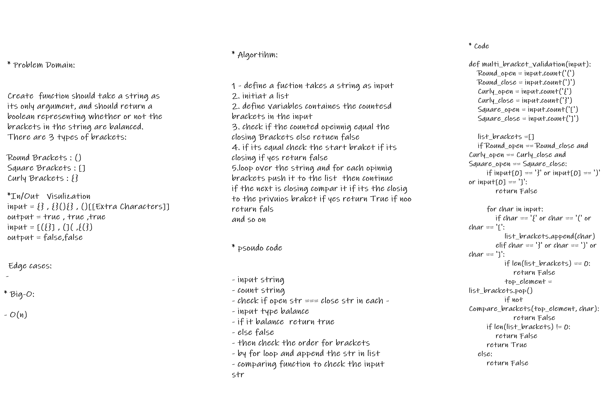

# Challenge Summary

 create function should take a string as its only argument, and should return a boolean representing whether or not the brackets in the string are balanced. There are 3 types of brackets:

Round Brackets : ()
Square Brackets : []
Curly Brackets : {}

## Whiteboard Process

## Approach & Efficiency

1 - define a fuction takes a string as input.
2. initiat a list.
3. define variables containes the countesd brackets in the input
4. check if the counted opeinnig equal the closing Brackets else retuen false
5. if its equal check the start braket if its closing if yes return false
6.loop over the string and for each opinnig brackets push it to the list  then continue.
7.if the next is closing compar it if its the closig to the privuios braket if yes return True if noo return fals
and so on.
