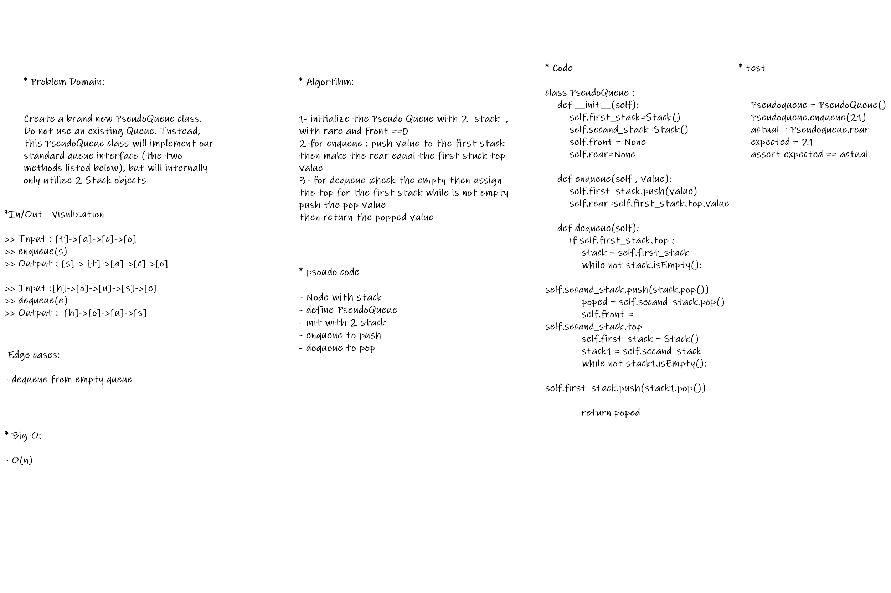

# Challenge Summary

Create a brand new PseudoQueue class. Do not use an existing Queue. Instead, this PseudoQueue class will implement our standard queue interface (the two methods listed below), but will internally only utilize 2 Stack objects

## Whiteboard Process

## Approach & Efficiency

  initiation class for PseudoQueue
  * init
  * tack 1 , stack 2 , front , rear
  * dequeue : which extracts a value from the PseudoQueue, using a first-in, first-out approach.
  * enqueue : which extracts a value from the PseudoQueue, using a first-in, first-out approach.

