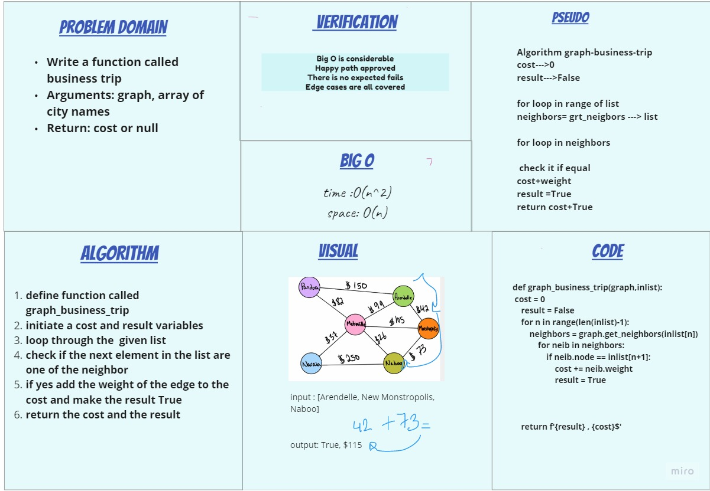

# code challenge-37

## Challenge Summary

Write a function called business trip
Arguments: graph, array of city names
Return: cost or null
Determine whether the trip is possible with direct flights, and how much it would cost.

### Whiteboard Process

### Approach & Efficiency

O(n^2)

### Solution

code: [file](graph_business_trip/business_trip.py)
tests: [file](tests/test_graph_business_trip.py)