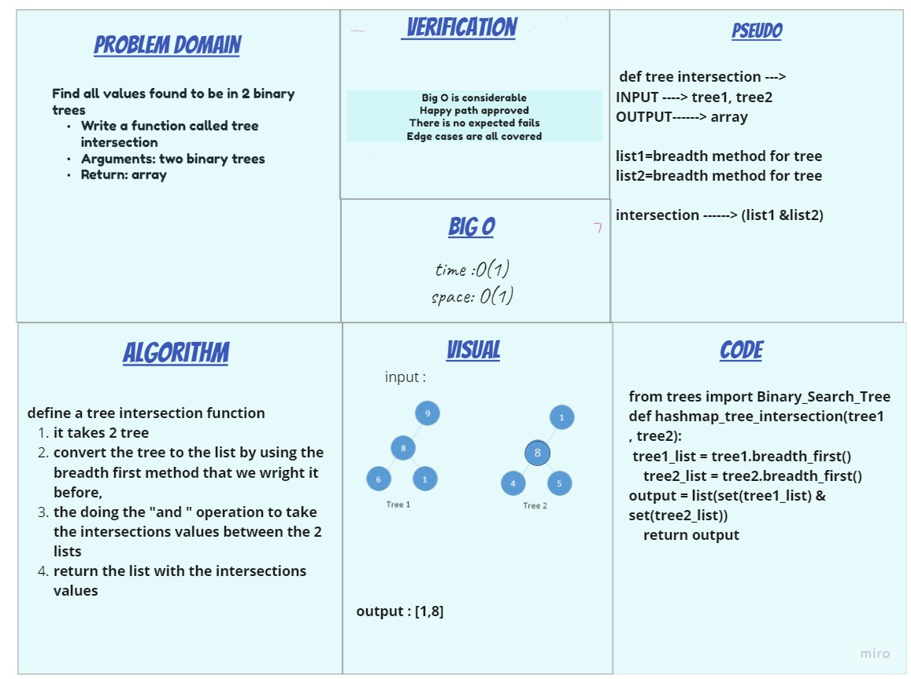

# Challenge Summary

Find all values found to be in 2 binary trees

- Write a function called tree intersection
- Arguments: two binary trees
- Return: array

## Whiteboard Process

## Approach & Efficiency

time :Θ(1)
space: O(1)

## Solution

[Code](hashmap_tree_intersection/tree_intersection.py)
[Test](tests/test_hashmap_tree_intersection.py)