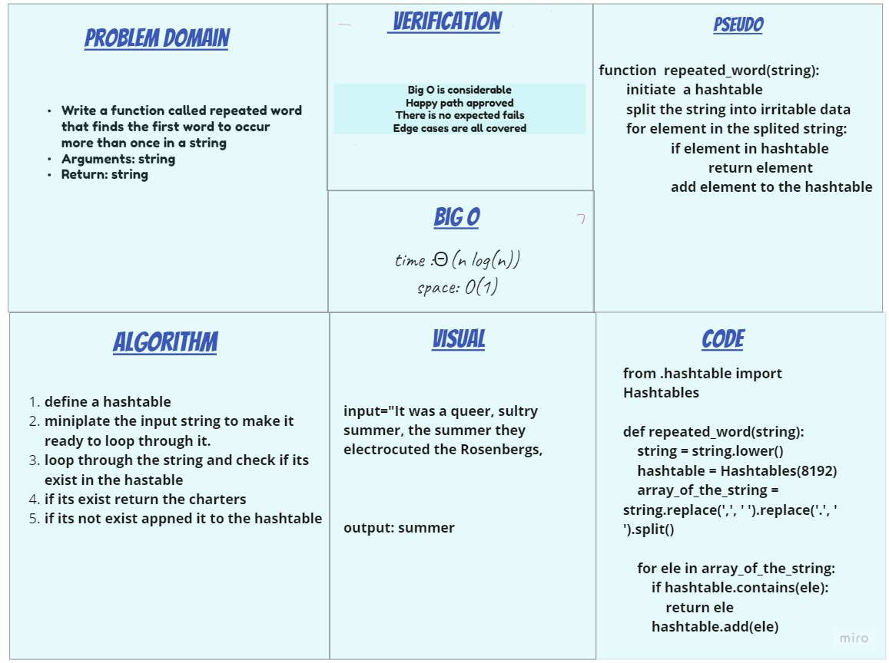

# Challenge Summary

Write a function called repeated word that finds the first word to occur more than once in a string

- Arguments: string
- Return: string

## Whiteboard Process

## Approach & Efficiency

time :Θ(n log(n))
space: O(1)

## Solution

[Code](hashmap_repeated_word/hashmap_repeated_word.py)
[Test](tests/test_hashmap_repeated_word.py)