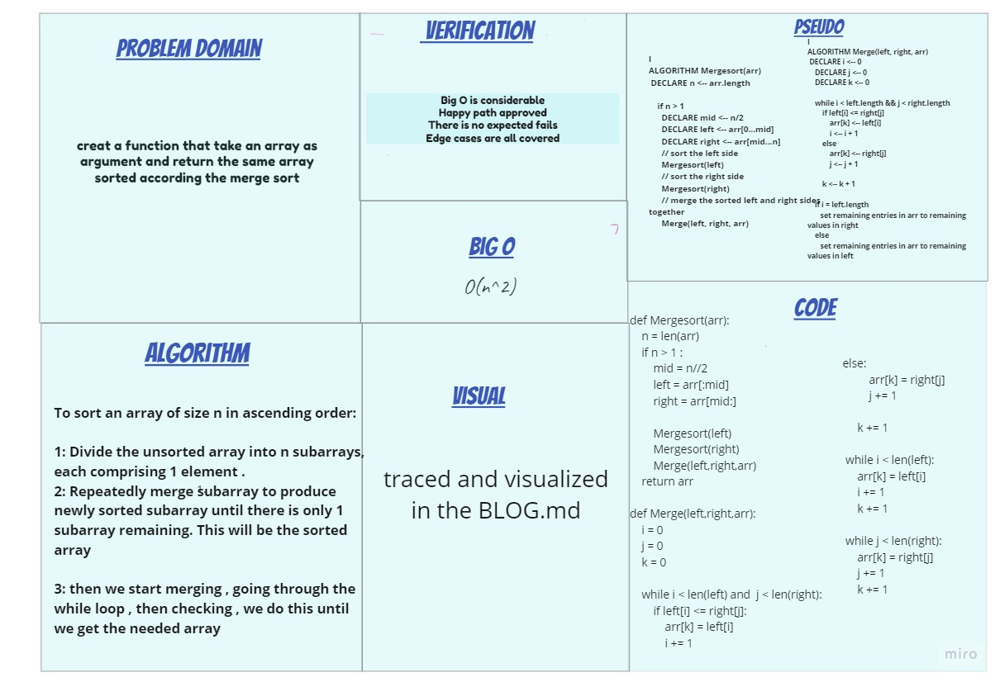

# Challenge-27 Summary

For thre Merge Sort trace the algorithm by stepping through the process with the provided sample array. Document your explanation by creating a blog article that shows the step-by-step output after each iteration through some sort of visual.

## Whiteboard Process

## Approach & Efficiency

The merge sort approach is the methodology which uses recursion mechanism. It starts at the Top and proceeds downwards, with each recursive turn asking the same question such as “What is required to be done to sort the array?” and having the answer as, “split the array into two, make a recursive call, and merge the results.”, until one gets to the bottom of the array-tree

## Solution

1. split the original list into two parts and re-call the merge-sort function again two times. in the first one we pass the list in the right and in the second we pass the the list in the left

2. split both lists from first step into two lists for each and re-call the merge-sort function again. however now we re-call four tims. one call for each list

3. split only lists with more than one value from second step into two lists for each list. now we start passing each right and left form this step and above. the last two splitted lists in this step will start merging because each one has a left and right then each merged list will merge with one from the above level

4. have two lists as a result from merging from down to above. these two lists will be passed with the original list to be merged into one sorted list

5. the two lists from step four merged and sorted into one single list and returned.

[blog](BLOG.md)