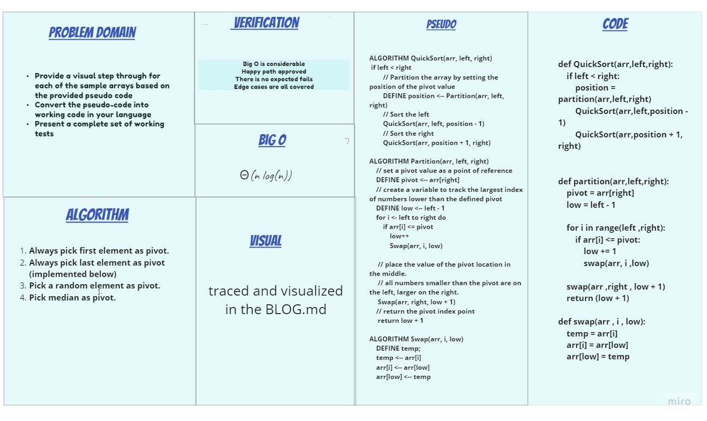

# Challenge-28 Summary

QuickSort is a Divide and Conquer algorithm. It picks an element as pivot and partitions the given array around the picked pivot. There are many different versions of quickSort that pick pivot in different ways.

## Whiteboard Process

## Approach & Efficiency

Quicksort is a comparison sort, meaning that it can sort items of any type for which a "less-than" relation (formally, a total order) is defined. Efficient implementations of Quicksort are not a stable sort, meaning that the relative order of equal sort items is not preserved.

Mathematical analysis of quicksort shows that, on average, the algorithm takes O(n log n) comparisons to sort n items. In the worst case, it makes O(n2) comparisons, though this behavior is rare.

## Solution

[blog](BLOG.md)